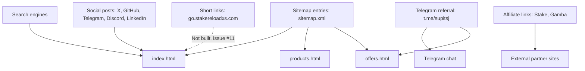

# User discovery map

How new users reach the storefront, and where each entry point lands. Based on the links present in the repo today. Channels marked "not in repo" have no link or tracking in the code.

## Entry points

| Channel | Entry point | Lands on | Status |
|---|---|---|---|
| Search | Organic results for the domain | `index.html`, or any page listed in `sitemap.xml` | Live. Sitemap lists `/`, products, offers, order, support, team. |
| Social | Posts linking to the domain | `index.html` | Partly live. The footer only links Telegram; X, GitHub, Discord and LinkedIn are not linked (issue #9). |
| Telegram referral | `t.me/supitsj` links on the site | Telegram chat; offers via the Stake and Gamba cards | Live. |
| Affiliates | Stake and Gamba cards on `offers.html` | Partner sites, with the affiliate link as the destination | Live but untracked. No click tracking (issue #12). |
| Short links | `go.stakereloadxs.com/...` | Not yet routed | Not built (issue #11). Sink is the chosen tool. |
| Shared previews | Open Graph and Twitter cards on each page | Same page as the link | Metadata present. Preview rendering on target platforms not yet verified (issue #9). |

## Gaps

- No channel reports where users came from. Click tracking (#11, #12) is the prerequisite for measuring any row above.
- The Discord, GitHub, X and LinkedIn profile URLs are missing, so those channels cannot send traffic to the site yet (issue #9).
- Once short links exist, add their entries to this map and update the diagram.
