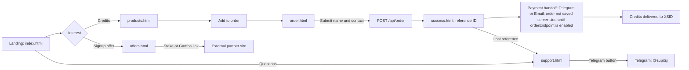

# Customer journey map

Covers the end-to-end path from landing page to support, as built in this repo. Touchpoints and pain points come from reading the pages and code. They have not been checked with real customers, so treat them as hypotheses.

## Stages

| Stage | Page | Touchpoints | Pain points (from repo review) |
|---|---|---|---|
| Landing | `index.html` | Hero, "Learn more" buttons (Telegram), Boost section | Most CTAs go straight to Telegram, not to a product or offer page. |
| Browse | `products.html` | Catalog from `data/products.json`, boost tiers 5% to 20% | Boost percentages are shown, but the FAQ does not explain them (see issue #21). |
| Offers | `offers.html` | Stake $21 signup, Gamba 25% share, Telegram button | Affiliate disclosure text is missing (issue #12). Offer terms and expiry are not stated (issue #13). |
| Order | `order.html` | Cart, name, contact method, notes | With no `orderEndpoint` set, the order falls back to a Telegram handoff. Only the Telegram or Email contact options are offered. |
| Confirmation | `success.html` | Reference ID, next steps | No payment step. Payment handoff depends on the Telegram or Email contact (CWallet deferred, issue #10). |
| Support | `support.html` | Telegram button, three FAQ entries | FAQ is thin: no payment, refund or delivery-time answers (issue #22). |

## Gaps this map exposes

- A customer can submit an order without any payment step, so the path from order to credits depends on a manual Telegram conversation.
- The only support channel is Telegram. Email is an order contact option but not a support channel.
- The team and about pages are placeholders, so trust signals are thin at the point of first contact (issues #14, #23).
